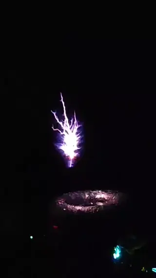
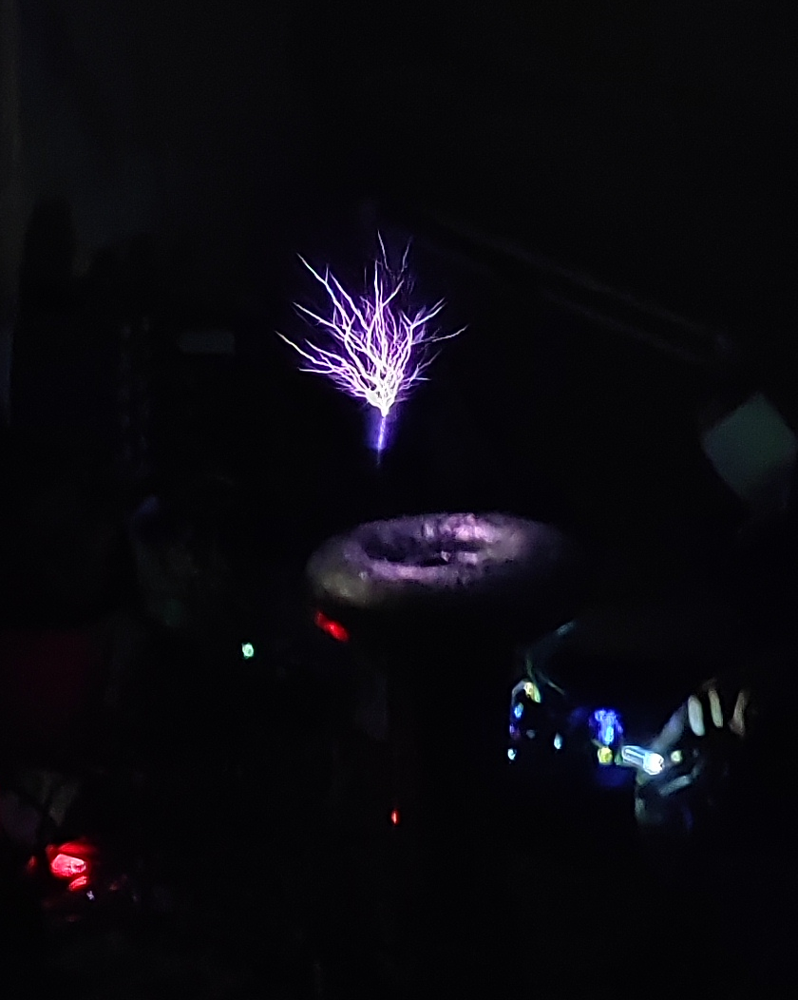

# Hossein Naderi's Musical Solid-State Tesla Coil

This repo contains all the circuitry and part designs used in this project. It's still a work in progress, but works nevertheless.
## Software Requirements
- FreeCAD
- KiCAD
- Nix (optional, but if you have it, you don't need any further explanation of course.)
  
## Build
Visit [project's website](https://projects.hnaderi.dev/sstc/)

## Download
You can either use the website or this [branch](https://github.com/hnaderi/sstc/tree/gh-pages)

## Customize parts
All parts are designed parametrically, so you can change dimensions in the sheet's values to create custom ones.

## Gallery

<figure>
  
  <figcaption>
    SSTC v3 running CW mode with FM music modulation at 2.5KW
  </figcaption>
</figure>
<figure>
  
  <figcaption>
    SSTC v2 running at 110v CW mode with FM music modulation
  </figcaption>
</figure>
<figure>
  
  <figcaption>
    SSTC v2 running at 110v interrupted mode
  </figcaption>
</figure>

